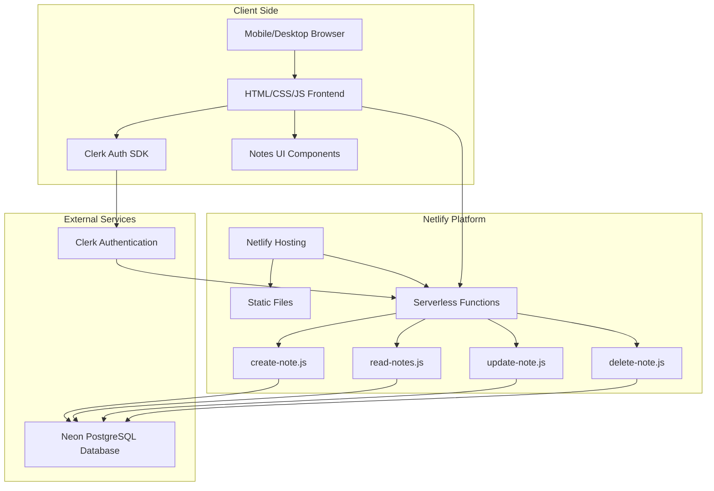
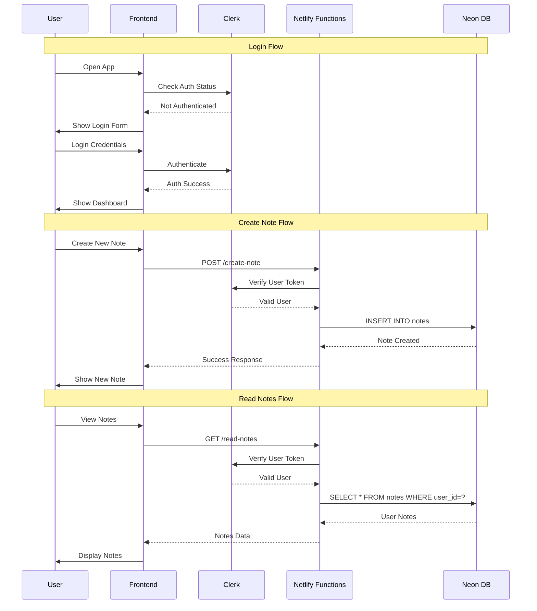
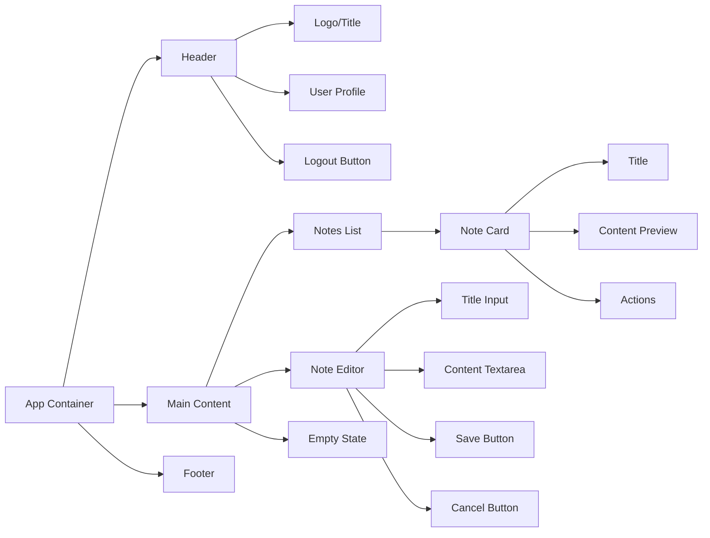

# Arsitektur Web Note App

## Diagram Arsitektur



## Flow Data



## Komponen UI



## Database Schema

```mermaid
erDiagram
    NOTES {
        int id PK
        varchar user_id FK
        varchar title
        text content
        timestamp created_at
        timestamp updated_at
    }
    
    USERS {
        varchar id PK
        string email
        string name
        timestamp created_at
    }
    
    NOTES ||--o{ USERS : belongs_to